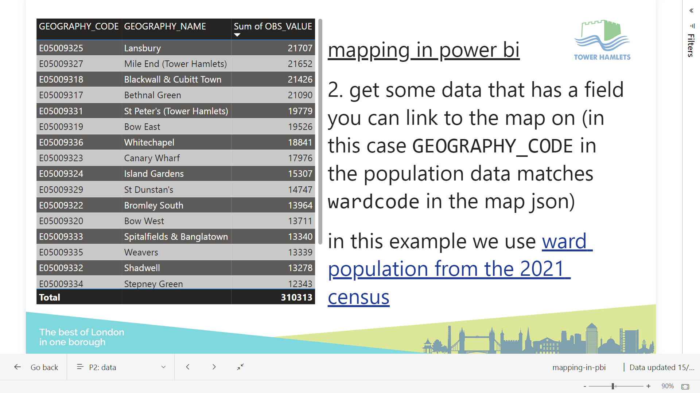

# mapping in pbi

> a "shape map" demo combining a topojson ward map and census data from the nomis api

## contents
* map - [`lbth-wards-2022.topo.json`](lbth-wards-2022.topo.json)
  * 2022 wards queried from [geoportal](https://services1.arcgis.com/ESMARspQHYMw9BZ9/ArcGIS/rest/services/Wards_December_2022_Boundaries_GB_BFC/FeatureServer/0/query?where=WD22CD+%3D+%27E05009317%27+OR+WD22CD+%3D+%27E05009318%27+OR+WD22CD+%3D+%27E05009319%27+OR+WD22CD+%3D+%27E05009320%27+OR+WD22CD+%3D+%27E05009321%27+OR+WD22CD+%3D+%27E05009322%27+OR+WD22CD+%3D+%27E05009323%27+OR+WD22CD+%3D+%27E05009324%27+OR+WD22CD+%3D+%27E05009325%27+OR+WD22CD+%3D+%27E05009326%27+OR+WD22CD+%3D+%27E05009327%27+OR+WD22CD+%3D+%27E05009328%27+OR+WD22CD+%3D+%27E05009332%27+OR+WD22CD+%3D+%27E05009333%27+OR+WD22CD+%3D+%27E05009329%27+OR+WD22CD+%3D+%27E05009330%27+OR+WD22CD+%3D+%27E05009331%27+OR+WD22CD+%3D+%27E05009334%27+OR+WD22CD+%3D+%27E05009335%27+OR+WD22CD+%3D+%27E05009336%27&geometryType=esriGeometryEnvelope&spatialRel=esriSpatialRelIntersects&resultType=none&distance=0.0&units=esriSRUnit_Meter&outFields=WD22CD%2C+WD22NM%2C+LAD22CD%2C+LAD22NM&returnGeometry=true&featureEncoding=esriDefault&multipatchOption=xyFootprint&returnExceededLimitFeatures=true&sqlFormat=none&f=pgeojson&token=) as geojson and converted to topojson with [mapshaper](https://mapshaper.org)
* data - [`lbth-ward-population-2021.csv`](lbth-ward-population-2021.csv)
  * population data queried from the [nomis api](https://www.nomisweb.co.uk/api/v01/dataset/NM_2021_1.data.csv?date=latest&geography=641730979...641730990,641730994,641730995,641730991...641730993,641730996...641730998&c2021_restype_3=0&measures=20100) and linked to map areas by `wardcode`
* report links together map+data - [`mapping-in-pbi.pbix`](mapping-in-pbi.pbix)
  * the source report (binary file format)
* [`./mapping-in-pbi/`](mapping-in-pbi)
  * the source report extracted with [pbi-tools](https://pbi.tools) to a folder of source code that can be edited, version controlled, and recompiled back to a binary `.pbit` file which in turn can be "re-dydrated" with data, and saved as a binary `.pbix`
* `theme.json`
  * the theme file: sets the corporate slide background image; implements the colour-blind safe [viridis palette](https://matplotlib.org/stable/gallery/color/colormap_reference.html) reversed as the main palette  (on a light background, [light colours map to low values; dark colours map to high values](https://journals.sagepub.com/stoken/default+domain/10.1177%2F15291006211051956-FREE/full?__cf_chl_tk=0OBvzryGvk5Hx7z2jy2mBy3dCt5vOabVgPzH7I0SkK0-1694038764-0-gaNycGzNDPs#fig18-15291006211051956)). the colours were generated with a pbi friendly [colormap generator](https://waldyrious.net/viridis-palette-generator/)
